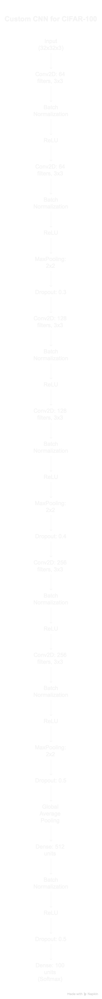

# (new.ipynb)Custom Convolutional Neural Network for CIFAR-100 Image Classification
## Introduction 
Convolutional Neural Networks (CNNs) are widely used in the field of computer vision for tasks such as image classification, object detection, and segmentation. The CIFAR-100 dataset, consisting of 60,000 images in 100 classes, presents a challenging task for deep learning models. This assignment explores the design and implementation of a custom CNN for image classification on the CIFAR-100 dataset. Additionally, the performance of the custom CNN is compared with several well-established deep learning architectures: ResNet-
50, VGG-19, DenseNet-121, and EfficientNetB0. The goal is to understand the key components of CNN architecture and evaluate their impact on model performance.
### Custom CNN Architecture
#### Architecture Design
The custom CNN architecture consists of three convolutional blocks followed by a fully connected classification head. The following layers and techniques were used in the design:

The custom CNN architecture consists of three convolutional blocks, each followed by batch normalization, ReLU activation, and max pooling. The first block uses 64 filters, the second uses 128, and the third uses 256 filters, all with a kernel size of 3 ×3. These filter sizes are standard in image classification tasks and help capture local spatial features at increasing levels of abstraction. A kernel size of 3 ×3 strikes a balance between capturing fine details and maintaining computational efficiency. Max pooling layers with a pool size of 2×2 are applied after each block to reduce spatial dimensions and retain dominant features.

The ReLU (Rectified Linear Unit) activation function is used after each convolutional and fully connected layer (except the final output layer) to introduce non-linearity and accelerate convergence during training. The output layer uses the Softmax activation function to convert the raw output scores into a probability distribution over the 100 CIFAR-100 classes,enabling multi-class classification.

### Regularization Techniques
• Dropout is applied after each convolutional block and in the fully connected head to reduce overfitting by randomly deactivating a fraction of neurons during training.
• Batch normalization is used after each convolutional and fully connected layer to stabilize training by normalizing the activations within a mini-batch.
### Hyperparameters
• An initial learning rate of 1 ×10−3 was used with the Adam optimizer, based on its ability to converge efficiently.
• A batch size of 128 was chosen to balance memory efficiency and training speed.The model was trained for 200 epochs, with early stopping and learning rate reduction strategies to prevent overfitting.

### Data Preprocessing
The CIFAR-100 dataset contains color images of size 32x32 pixels. The preprocessing steps
involved:
• Reshaping and Normalization: The images were reshaped into the format (32, 32, 3),and pixel values were normalized by dividing by 255.0 to scale the values to the range
[0, 1].
• Data Augmentation: To reduce overfitting and improve generalization, data augmentation techniques such as rotation (up to 15 degrees), width and height shifts (up to10%), horizontal flipping, and zooming (up to 10%) were applied.
• Label Encoding: The labels were kept in integer format to use sparse categorical cross-entropy loss, which is appropriate for integer labels in classification tasks.
